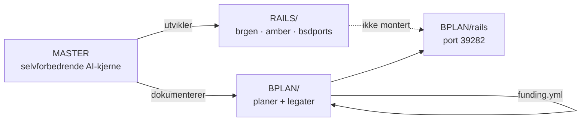

# BPLAN — forretningsplaner og legatsøknader

Én HTML per idé. Så mange legater som mulig.

**BPLAN/rails** er en egen, frittstående Rails-app — den ligger **ikke** under `RAILS/` og er **ikke** montert i `brgen.no`, `amber.brgen.no` eller andre deploy-apper. `RAILS/apps.yml` gjelder kun `RAILS/brgen`, `RAILS/amber`, `RAILS/bsdports` osv.

## Arkitektur



## Struktur

```
BPLAN/
  *.html              # 14 forretningsplaner (statisk)
  legats/             # 97+ søknader
  funding.yml         # kanonisk økonomi
  build_plans.rb
  build_legats.rb
  grok_send_legats.rb # batch-sending med mutt
  send_legats.sh      # tynn wrapper
  lib/bplan/          # html + validate
  Makefile            # build + test
  rails/              # standalone Rails 8 app (port 39282)
```

## Bygg og test

```bash
cd BPLAN
make bplan          # build_plans + build_legats + test
make validate       # Bplan::Validate.validate_all!
make build          # kun HTML-generering
make test           # validate_test + build_plans_test
```

Eller manuelt:

```bash
ruby build_plans.rb
ruby build_legats.rb
ruby -Ilib -e 'require "bplan/validate"; Bplan::Validate.validate_all!'
```

## Rails (egen app)

```bash
cd BPLAN/rails
./bin/setup
bundle exec rails server
# → http://localhost:39282
```

Sett `BPLAN_VIPPS_NUMBER` for Vipps-betalingsinstruksjoner (også på VPS ved deploy).

## Deploy (egen app, ikke RAILS/)

Manifest: `bplan.yml` — **ikke** i `RAILS/apps.yml`.

```bash
# på VPS (OpenBSD)
export BPLAN_VIPPS_NUMBER=12345678   # valgfritt
export BUILD_ID=$(git rev-parse --short HEAD)  # valgfritt override
cd BPLAN/rails && ./bplan.sh
# → bplan.pub.healthcare :39282
```

Synker `BPLAN/rails` → `/home/bplan/app` og resten av `BPLAN/` → `/home/bplan/content` (respekterer `.deployignore`).

## Fristkalender

I `funding.yml` under `deadlines:` — vises på index, legater og Rails-frontpage.
Regenerer: `ruby build_plans.rb`.

Batch `frist_host_2026` henter `legat_id` automatisk fra deadlines med `batch: frist_host_2026`.

## Send legater

```bash
cd BPLAN

# Dry-run (skriver .eml til legats/outbox/)
ruby grok_send_legats.rb --batch bolig_asap --dry-run
ruby grok_send_legats.rb --id 02_trond_mohn_medical_ai --dry-run

# Faktisk sending (krever --confirm, daglig tak LEGAT_DAILY_CAP=5)
ruby grok_send_legats.rb --batch helse --confirm
FORCE_IN=1 ruby grok_send_legats.rb --id 01_innovasjon_norge_master --confirm

# Shell-wrapper
./send_legats.sh --list
./send_legats.sh --dry-run 02_trond_mohn_medical_ai
./send_legats.sh --confirm 02_trond_mohn_medical_ai
```

Sikkerhetsregler:
- Hopper over `draft`, `sendable: false`, self-to (`bergen@pub.attorney`)
- Hopper over `*innovasjon_norge*` med mindre `FORCE_IN=1`
- `sent_log.yml` hindrer duplikater
- Egendefinert cover: `legats/covers/<id>.txt`
- Batch-rapport: `legats/reports/*.md`

## CI

`.github/workflows/bplan.yml` — `build_plans`, `build_legats`, `make test`, `rails test`.

## Forbedringslogg

Se `IMPROVEMENTS.yml` — 320 forslag med status `implemented|deferred|ops`.