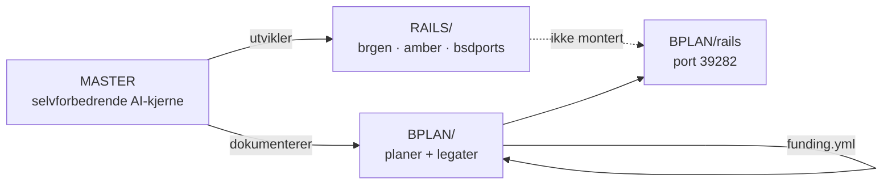

# BPLAN — forretningsplaner og legatsøknader

Én HTML per idé. Så mange legater som mulig.

**BPLAN/rails** er en egen, frittstående Rails-app — den ligger **ikke** under `RAILS/` og er **ikke** montert i `brgen.no`, `amber.brgen.no` eller andre deploy-apper. `RAILS/apps.yml` gjelder kun `RAILS/brgen`, `RAILS/amber`, `RAILS/bsdports` osv.

## Arkitektur



## Struktur

```
BPLAN/
  *.html              # 15 forretningsplaner (statisk)
  legats/             # 96 søknader
  funding.yml         # kanonisk økonomi
  build_plans.rb
  build_legats.rb
  grok_send_legats.rb # batch-sending med mutt
  send_legats.sh      # tynn wrapper
  lib/bplan/          # html + validate
  Makefile            # build + test
  rails/              # standalone Rails 8 app (port 39282)
```

## Bygg og test

```bash
cd BPLAN
make bplan          # build_plans + build_legats + test
make validate       # Bplan::Validate.validate_all!
make build          # kun HTML-generering
make test           # validate_test + build_plans_test
```

Eller manuelt:

```bash
ruby build_plans.rb
ruby build_legats.rb
ruby -Ilib -e 'require "bplan/validate"; Bplan::Validate.validate_all!'
```

## Rails (egen app)

```bash
cd BPLAN/rails
./bin/setup
bundle exec rails server
# → http://localhost:39282
```

Sett `BPLAN_VIPPS_NUMBER` for Vipps-betalingsinstruksjoner (også på VPS ved deploy).

## Deploy (egen app, ikke RAILS/)

Manifest: `bplan.yml` — **ikke** i `RAILS/apps.yml`.

```bash
# på VPS (OpenBSD)
export BPLAN_VIPPS_NUMBER=12345678   # valgfritt
export BUILD_ID=$(git rev-parse --short HEAD)  # valgfritt override
cd BPLAN/rails && ./bplan.sh
# → bplan.pub.healthcare :39282

# Fra workstation (git pull + OPERATOR + standalone):
zsh OPENBSD/deploy_all.sh

# Kun BPLAN på VPS:
zsh OPENBSD/deploy_standalone_apps.sh
```

Synker `BPLAN/rails` → `/home/bplan/app` og resten av `BPLAN/` → `/home/bplan/content` (respekterer `.deployignore`).

## Fristkalender

I `funding.yml` under `deadlines:` — vises på index, legater og Rails-frontpage.
Regenerer: `ruby build_plans.rb`.

Batch `frist_host_2026` henter `legat_id` automatisk fra deadlines med `batch: frist_host_2026`.

## Send legater (PDF → e-post)

**68 sendbare** søknader med mottaker-e-post ligger i `legats/manifest.yml` (fra Legathåndboken / stipendportalen / givernes nettsider). Portal-only (Gunvor, Zuccarelli, …) er **ikke** i auto-send — last opp manuelt på stipendportalen.no.

### På OpenBSD (vm23)

```bash
pkg_add mutt chromium    # PDF + sending
doas rcctl start smtpd   # lokal utgående post

cd ~/pub4/BPLAN
export MUTT_CONFIG=$PWD/etc/muttrc

./legat_mailer.sh build          # regenerer HTML + PDF i legats/pdfs/
./legat_mailer.sh list           # alle 68 med e-post
./legat_mailer.sh batches        # bolig_asap, helse, innovasjon, …
./legat_mailer.sh dry-run helse  # forhåndsvis i legats/outbox/

LEGAT_SEND=1 ./legat_mailer.sh send helse              # faktisk send (max 5/dag)
LEGAT_SEND=1 FORCE_IN=1 ./legat_mailer.sh send innovasjon   # inkl. Innovasjon Norge
```

### Vanlige batches

| Batch | Innhold |
|-------|---------|
| `bolig_asap` | Startlån, NAV, sosiale legater (e-post) |
| `helse` | Helse/velferd-legater |
| `bergen_legathandboken` | Bergen-stiftelser fra katalogen |
| `innovasjon` | IN, SkatteFUNN, regional (IN krever `FORCE_IN=1`) |
| `all_sendable` | Alle 68 — bruk forsiktig |

Sikkerhet: `LEGAT_SEND=1` latch, `sent_log.yml` mot duplikater, `LEGAT_DAILY_CAP=5`, Innovasjon Norge krever `FORCE_IN=1`.

## CI

`.github/workflows/bplan.yml` — `build_plans`, `build_legats`, `make test`, `rails test`.

## Forbedringslogg

Se `IMPROVEMENTS.yml` — 320 forslag med status `implemented|deferred|ops`.