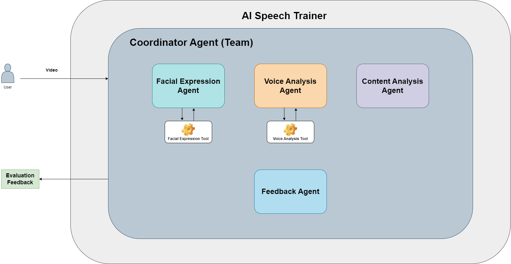

# AI Speech Trainer Agent

## Overview
AI Speech Trainer is a multi‑agent, multimodal coach that listens to your speech, watches your expression, and evaluates your delivery. It offers personalized feedback to improve confidence, clarity, and effectiveness for TED talks, interviews, or presentations.

## Core Value
- Real‑time, multimodal analysis (audio, video, text)  
- Immediate, actionable feedback  
- Scalable agent architecture for complex tasks  

## Key Features
### Analysis Agents
- **Facial Agent** – Detects emotion, engagement, eye contact  
- **Vocal Agent** – Measures pace, pitch, filler words  
- **Content Agent** – Evaluates structure, tone, grammar via LLM  
- **Feedback Agent** – Synthesizes agent outputs into a rubric score  - **Coordinator Agent** – Orchestrates agents and generates final report  

### Output- Score, strengths, weaknesses, concrete improvement suggestions  
- Visual summary of performance  

## How It Works
1. Upload a video clip to the Streamlit UI.  
2. Agents process the media:  
   - Facial Agent extracts expression and eye‑contact metrics.  
   - Vocal Agent transcribes audio and extracts prosodic features.  
   - Content Agent runs an LLM to assess textual content.  
3. Coordinator aggregates results and produces a feedback report.  

## Tech Stack- **Agno** – Multi‑agent orchestration framework  
- **Streamlit** – Frontend UI  
- **FastAPI** – Backend API  
- **OpenCV + DeepFace + Mediapipe** – Facial analysis  
- **Faster‑Whisper + Librosa** – Voice transcription and analysis  
- **Together API (Llama‑3.3‑70B‑Instruct‑Turbo‑Free)** – LLM for content feedback  

## Setup
1. Clone repository  
2. Install dependencies (`pip install -r requirements.txt`)  
3. Add `TOGETHER_API_KEY=...` to `.env`  
4. Start backend: `uvicorn main:app --reload` (backend folder)  
5. Launch UI: `streamlit run Home.py` (frontend folder)  

## Architecture Overview

## UI Screens
- **Home** – Video upload and transcript view  
- **Feedback** – Scores, strengths, weaknesses, suggestions, chart  

## Limitations- Token limit restricts video length to ~15‑30 seconds with the default LLM.  
- For longer clips, replace the LLM endpoint with another provider and update `.env`.  

## Team
- Lead: [aminajavaid30](https://github.com/aminajavaid30) – System design, implementation  
- Background: Data science and software engineering with experience in AI products and agentic workflows  

## Demo[Watch video demo](https://youtu.be/Sb0JPUpJTGQ)  

## Future Enhancements
- Real‑time recording and avatar playback  
- Session history logging  
- Performance dashboard for longitudinal tracking  

- End of document -