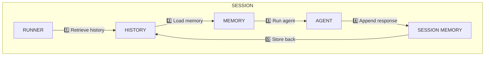

# 7‑Session Workflow

The 7‑session workflow is the heart of the OpenAI SDK crash course. Each **session** runs a deterministic pipeline that:

1. Loads the conversation history.  
2. Builds a `Master::Memory` slice respecting the configured context window and system prompts.  
3. Executes the `Master::Agent` (default model `deepseek‑ai/deepseek‑v3`).  
4. Appends the agent’s response to the in‑memory session buffer.  
5. Persists the updated buffer for the next round.

All stages live in **`lib/master/pipeline.rb`** and are orchestrated by the **RUNNER** defined in **`lib/master/agent.rb`**.

## Diagram

## Step‑by‑step

| # | Action | Component | Source |
|---|--------|-----------|--------|
| 1 | Load full conversation log from the persistent store. | `Master::Session#load_history` | `lib/master/session.rb` |
| 2 | Convert raw history to `Master::Memory`, slice to the context window, inject system prompts. | `Master::Memory#initialize` | `lib/master/memory.rb` |
| 3 | Perform inference with the default model. | `Master::Agent#call` | `lib/master/agent.rb` |
| 4 | Append `Result::Ok` payload to the in‑memory session buffer. | `Master::Session#append_response` | `lib/master/session.rb` |
| 5 | Serialize and write the updated buffer back to the history store. | `Master::Session#persist` | `lib/master/session.rb` |

## Why seven sessions?

Running the pipeline **seven** times highlights:

* Context growth across calls.  
* Adaptation to new user input.  
* State persistence (`history.json`, `memory.yml`, …) after each step.

Inspect the intermediate files to see exactly what the pipeline feeds into the next round.

## Extending the workflow

* **Swap the model** – edit `Master::Config.default_model` (`lib/master/config.rb`).  
* **Resize the context window** – adjust `Master::ContextWindow::DEFAULT_SIZE`.  
* **Add a pre‑processing stage** – create a new class under `lib/master/stages/` and insert its name into `Master::Pipeline::STAGES`.

All changes are hot‑reloaded by `Master::AutoLoop`, so you can iterate without restarting the server.